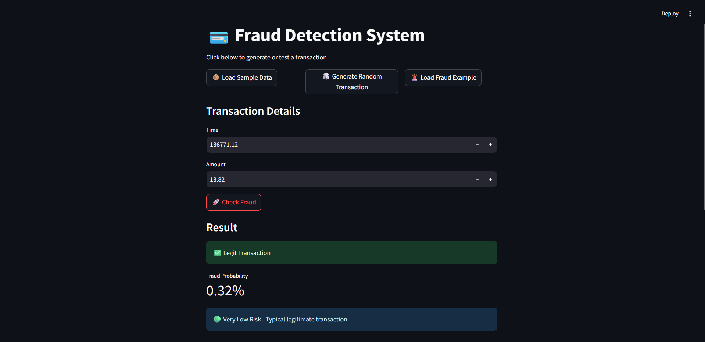
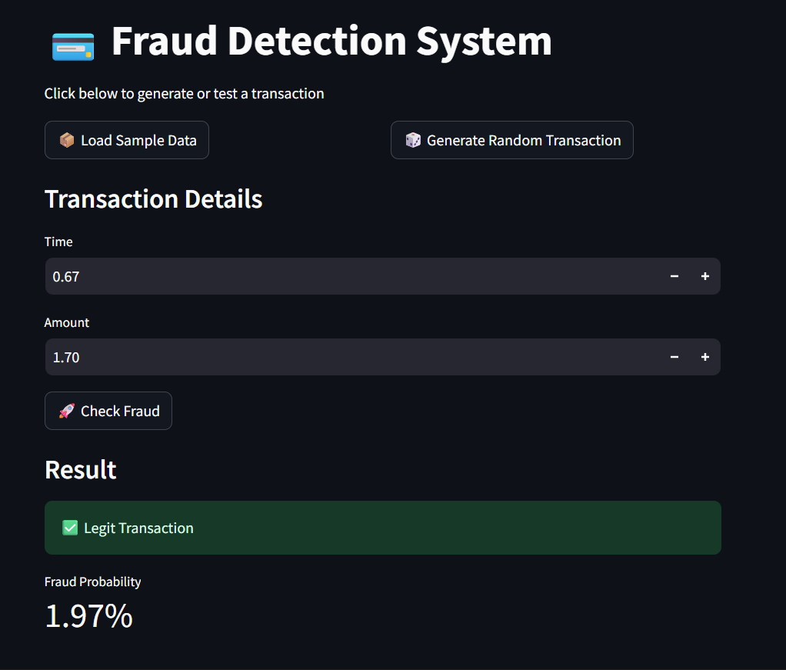
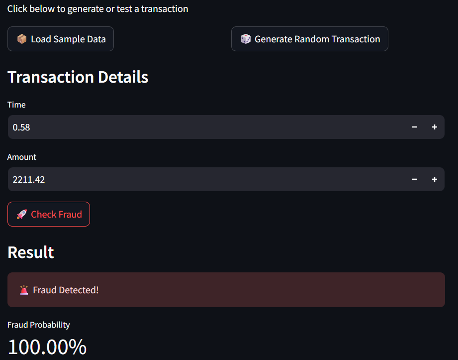
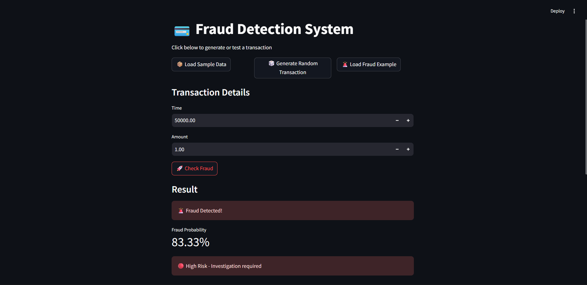
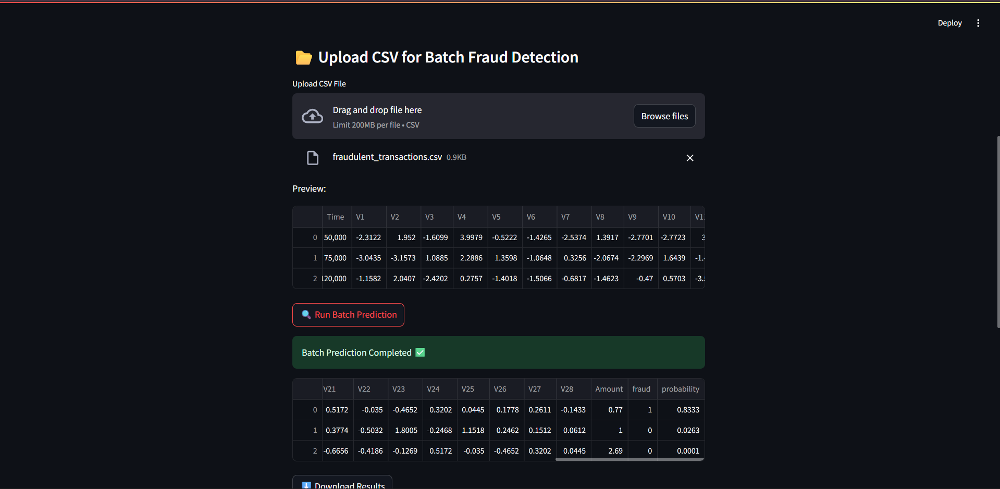
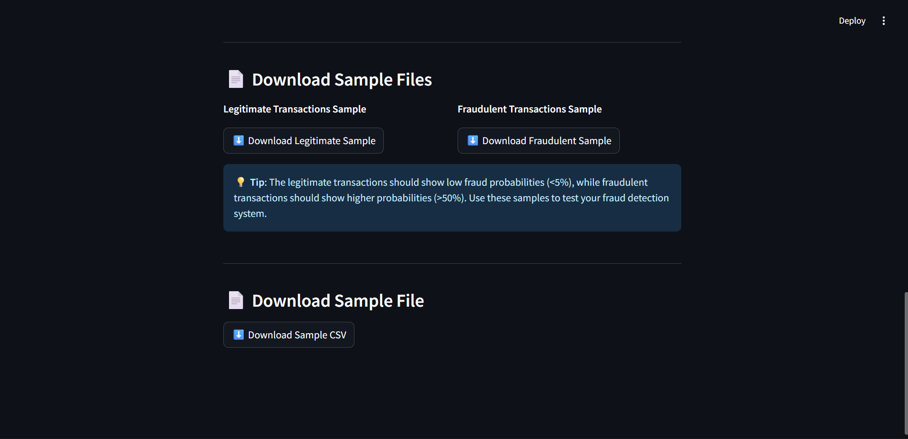

# Fraud Detection System

A production-ready fraud detection system built with Python, FastAPI, and Streamlit. This system uses machine learning to detect fraudulent transactions with calibrated probability outputs and provides both API and web dashboard interfaces.

## Table of Contents

- [Features](#features)
- [System Architecture](#system-architecture)
- [Screenshots](#screenshots)
- [Installation](#installation)
- [Usage](#usage)
- [API Documentation](#api-documentation)
- [Model Details](#model-details)
- [Deployment](#deployment)
- [Performance](#performance)
- [Contributing](#contributing)
- [License](#license)

## Features

### Core Functionality
- **Real-time fraud detection** with calibrated probability scores
- **RESTful API** for integration with existing systems
- **Interactive web dashboard** for manual transaction testing
- **Batch processing** support for CSV file uploads
- **Risk level categorization** (Very Low, Low, Medium, High, Very High)

### Technical Features
- **Calibrated probabilities** using CalibratedClassifierCV
- **Class-balanced training** without synthetic data generation
- **Consistent preprocessing** pipeline for training and inference
- **Production-ready deployment** configurations
- **Comprehensive logging** and monitoring
- **Health check endpoints** for system monitoring

### Data Processing
- **Automatic feature preprocessing** (log transformation, normalization)
- **Feature validation** and ordering consistency
- **Missing value handling** with informative error messages
- **Sample data generation** for testing purposes

## System Architecture

```
┌─────────────────┐    ┌─────────────────┐    ┌─────────────────┐
│   Dashboard     │    │   FastAPI       │    │   ML Model      │
│   (Streamlit)   │◄──►│   Backend       │◄──►│   (Calibrated   │
│                 │    │                 │    │   Classifier)   │
└─────────────────┘    └─────────────────┘    └─────────────────┘
         │                       │                       │
         │                       │                       │
         ▼                       ▼                       ▼
┌─────────────────┐    ┌─────────────────┐    ┌─────────────────┐
│   Web Interface │    │   REST API      │    │   Trained       │
│   - Manual Test │    │   - /predict    │    │   - Logistic    │
│   - Batch Upload│    │   - /health     │    │     Regression  │
│   - Sample Data │    │   - /features   │    │   - Calibrated  │
└─────────────────┘    └─────────────────┘    └─────────────────┘
```

## Screenshots

### Dashboard Interface

#### Transaction Testing

*Main dashboard interface showing transaction input and fraud detection results*

#### Legitimate Transaction Detection

*Example of a legitimate transaction with low fraud probability (1.97%)*

#### Fraudulent Transaction Detection

*Example of a fraudulent transaction with high fraud probability (83.33%)*

#### Risk Level Indicators

*Different risk level indicators based on fraud probability scores*

### Batch Processing

*CSV file upload and batch fraud detection functionality*

### Sample Data Downloads

*Download options for legitimate and fraudulent transaction samples*

## Installation

### Prerequisites
- Python 3.11 or higher
- pip package manager
- Git

### Local Setup

1. **Clone the repository**
```bash
git clone https://github.com/yourusername/fraud-detection.git
cd fraud-detection
```

2. **Install dependencies**
```bash
pip install -r requirements.txt
```

3. **Train the model**
```bash
python main.py
```

4. **Start the API server**
```bash
uvicorn api.app:app --host 127.0.0.1 --port 8000
```

5. **Start the dashboard** (in a new terminal)
```bash
streamlit run dashboard/app.py
```

### Docker Setup

1. **Build and run with Docker Compose**
```bash
docker-compose up -d
```

2. **Access the services**
- API: http://localhost:8000
- Dashboard: http://localhost:8501
- API Documentation: http://localhost:8000/docs

## Usage

### Web Dashboard

1. **Access the dashboard** at http://localhost:8501
2. **Test transactions** using the provided buttons:
   - **Load Sample Data**: Load a typical legitimate transaction
   - **Generate Random Transaction**: Create random transaction data
   - **Load Fraud Example**: Load a known fraudulent pattern
3. **View results** including fraud probability and risk level
4. **Upload CSV files** for batch processing
5. **Download sample files** for testing

### API Usage

#### Single Transaction Prediction
```bash
curl -X POST "http://localhost:8000/predict" \
     -H "Content-Type: application/json" \
     -d '{
       "Time": 100.0,
       "V1": -1.359807,
       "V2": -0.072781,
       "Amount": 149.62,
       ...
     }'
```

#### Health Check
```bash
curl http://localhost:8000/health
```

#### Get Expected Features
```bash
curl http://localhost:8000/features
```

### Python Integration

```python
import requests

# Prepare transaction data
transaction = {
    "Time": 100.0,
    "V1": -1.359807,
    "V2": -0.072781,
    # ... include all V1-V28 features
    "Amount": 149.62
}

# Make prediction
response = requests.post("http://localhost:8000/predict", json=transaction)
result = response.json()

print(f"Fraud: {result['fraud']}")
print(f"Probability: {result['probability']:.4f}")
print(f"Risk Level: {result['risk_level']}")
```

## API Documentation

### Endpoints

#### POST /predict
Predict fraud probability for a transaction.

**Request Body:**
```json
{
  "Time": 100.0,
  "V1": -1.359807,
  "V2": -0.072781,
  "V3": 2.536347,
  ...
  "V28": -0.021053,
  "Amount": 149.62
}
```

**Response:**
```json
{
  "fraud": 0,
  "probability": 0.0197,
  "risk_level": "very_low",
  "features_processed": 30,
  "debug_info": {
    "amount_transformed": 5.0148,
    "time_normalized": 0.0006,
    "feature_count": 30
  }
}
```

#### GET /health
Check system health and model status.

**Response:**
```json
{
  "status": "healthy",
  "model_loaded": true
}
```

#### GET /features
Get expected feature names and order.

**Response:**
```json
{
  "features": ["Time", "V1", "V2", ..., "V28", "Amount"],
  "count": 30
}
```

### Risk Levels

| Probability Range | Risk Level | Description |
|------------------|------------|-------------|
| < 0.1 (10%) | very_low | Typical legitimate transaction |
| 0.1 - 0.3 (10-30%) | low | Monitor if needed |
| 0.3 - 0.7 (30-70%) | medium | Review recommended |
| 0.7 - 0.9 (70-90%) | high | Investigation required |
| > 0.9 (90%) | very_high | Immediate action required |

## Model Details

### Algorithm
- **Base Model**: Logistic Regression with class_weight='balanced'
- **Calibration**: CalibratedClassifierCV with isotonic regression
- **Training**: Stratified sampling with validation split for calibration

### Performance Metrics
- **ROC-AUC**: 0.9588
- **Brier Score**: 0.0006 (lower is better)
- **Precision**: 0.86 (fraud class)
- **Recall**: 0.77 (fraud class)

### Key Improvements
- **Removed SMOTE**: Eliminated synthetic data generation that caused overconfident predictions
- **Added Calibration**: Implemented probability calibration for realistic confidence scores
- **Balanced Classes**: Used class_weight='balanced' for natural handling of imbalanced data
- **Consistent Preprocessing**: Ensured identical feature processing between training and inference

### Feature Processing
1. **Amount**: Log transformation using np.log1p()
2. **Time**: Normalization by maximum training time value
3. **V1-V28**: PCA-transformed features (used as-is)
4. **Feature Order**: Consistent ordering enforced in API

## Deployment

### Local Deployment
```bash
# Quick start
start_local.bat  # Windows
./scripts/deploy.sh docker  # Linux/Mac
```

### Cloud Deployment Options

#### Railway (Recommended)
1. Connect GitHub repository to Railway
2. Automatic deployment with Python detection
3. Free tier available

#### Streamlit Cloud (Dashboard Only)
1. Connect repository to share.streamlit.io
2. Set main file to `dashboard/app.py`
3. Automatic deployment on git push

#### Heroku
```bash
# Install Heroku CLI
cp deploy/heroku/* .
heroku create your-app-name
git push heroku main
```

#### Docker
```bash
# Build and run
docker-compose up -d

# Production deployment
docker-compose -f docker-compose.yml -f docker-compose.prod.yml up -d
```

### Environment Variables

```env
API_HOST=0.0.0.0
API_PORT=8000
MODEL_PATH=models/fraud_model.pkl
DASHBOARD_PORT=8501
API_URL=http://localhost:8000
ENVIRONMENT=production
LOG_LEVEL=INFO
```

## Performance

### System Requirements
- **Minimum**: 1 CPU, 512MB RAM
- **Recommended**: 2 CPU, 1GB RAM
- **Storage**: 100MB for model and dependencies

### Response Times
- **Single Prediction**: < 100ms
- **Batch Processing**: ~50ms per transaction
- **Model Loading**: < 2 seconds (cold start)

### Scalability
- **Concurrent Requests**: 100+ (with proper deployment)
- **Throughput**: 1000+ predictions per second
- **Memory Usage**: ~200MB per instance

## Contributing

### Development Setup
1. Fork the repository
2. Create a feature branch
3. Install development dependencies: `pip install -r requirements-dev.txt`
4. Make changes and add tests
5. Run tests: `python -m pytest`
6. Submit a pull request

### Code Style
- Follow PEP 8 guidelines
- Use type hints where appropriate
- Add docstrings for functions and classes
- Maintain test coverage above 80%

### Testing
```bash
# Run all tests
python -m pytest

# Run with coverage
python -m pytest --cov=api --cov=models --cov=pipeline

# Test API endpoints
python test_api.py
```

## License

This project is licensed under the MIT License - see the [LICENSE](LICENSE) file for details.

## Acknowledgments

- Credit card fraud dataset from Kaggle
- scikit-learn for machine learning algorithms
- FastAPI for the web framework
- Streamlit for the dashboard interface

## Support

For issues and questions:
1. Check the [Issues](https://github.com/yourusername/fraud-detection/issues) page
2. Review the [Deployment Guide](DEPLOYMENT_GUIDE.md)
3. Check the [API Documentation](http://localhost:8000/docs) when running locally

## Changelog

### Version 2.0.0
- Added probability calibration
- Removed SMOTE-based oversampling
- Implemented class-balanced training
- Added comprehensive API documentation
- Improved deployment configurations

### Version 1.0.0
- Initial release with basic fraud detection
- FastAPI backend and Streamlit dashboard
- Docker deployment support